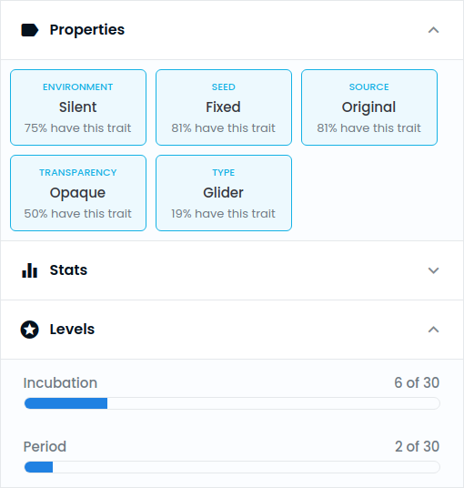
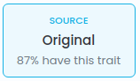
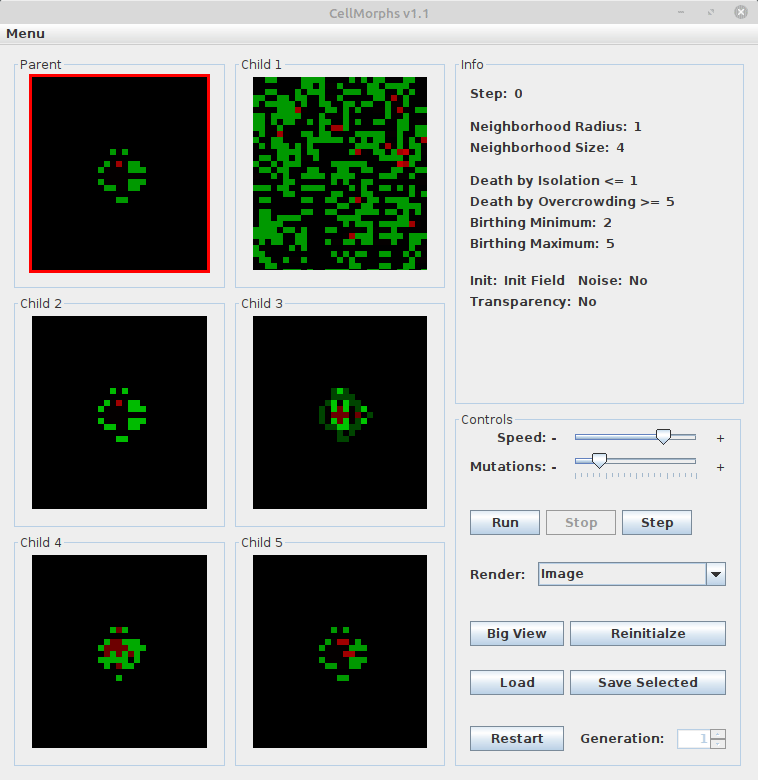
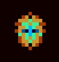

---
# Feel free to add content and custom Front Matter to this file.
# To modify the layout, see https://jekyllrb.com/docs/themes/#overriding-theme-defaults
#
# Test website locally:
# bundle exec jekyll serve

layout: default
title: CellMorphs
image: assets/img/cellmorphs-banner-800x400.png
---

# CellMorphs NFTs

CellMorphs are created using the CellMorphs open source software, see below. They are available as a blockchain-based [OpenSea NFT collection](https://opensea.io/collection/cellmorphs)! The collection is growing, but the total supply will be limited to 500.

    

Here are some examples from the collection:

<nft-card
contractAddress="0x495f947276749ce646f68ac8c248420045cb7b5e"
tokenId="103593194175715173505482960922039270722014244909469076189175361128878120632321">
</nft-card>

<nft-card
contractAddress="0x495f947276749ce646f68ac8c248420045cb7b5e"
tokenId="103593194175715173505482960922039270722014244909469076189175361131077143887873">
</nft-card>

<nft-card
contractAddress="0x495f947276749ce646f68ac8c248420045cb7b5e"
tokenId="103593194175715173505482960922039270722014244909469076189175361132176655515649">
</nft-card>

## CellMorphs Attributes

The NFT attributes reflect the characteristics and behaviour of the CellMorphs. Some attributes and combinations are rarer than others:

{: .center-image }

If you create an interesting CellMorph, [contact me](mailto:aimfeld@aimfeld.ch) and I may add it to the NFT collection. Let's see if you discover a cooler CellMorph than my [praying monkey](https://opensea.io/assets/0x495f947276749ce646f68ac8c248420045cb7b5e/103593194175715173505482960922039270722014244909469076189175361128878120632321/) :).

## CellMorphs Breeding 

As an owner of a childless _original_ CellMorph, you can use it to derive and propose a child CellMorph. The .cm file of your CellMorph is provided as unlockable content. Download it and open it with the [CellMorphs software](#cellmorphs-software). 

If you breed an interesting CellMorph child, save it and [e-mail me](mailto:aimfeld@aimfeld.ch) the .cm file, suggest a CellMorph name, and include an OpenSea link to your _original_ CellMorph. Once your proposal passes revision, you will be able to mint your child CellMorph for free (gas fees apply). Look for the _original_ property:

{: .center-image }

For example, Climate Change is a child of Green Cells:

<nft-card
contractAddress="0x495f947276749ce646f68ac8c248420045cb7b5e"
tokenId="103593194175715173505482960922039270722014244909469076189175361145370795048961">
</nft-card>

<nft-card
contractAddress="0x495f947276749ce646f68ac8c248420045cb7b5e"
tokenId="103593194175715173505482960922039270722014244909469076189175361139873236910081">
</nft-card>

# What are CellMorphs

CellMorphs are evolved [cellular automata](http://en.wikipedia.org/wiki/Cellular_automata). Cellular automata are complex dynamical systems that exhibit overall behavior that cannot be traced back to the underlying rules. In other words, they show [emergent](http://en.wikipedia.org/wiki/Emergence) or self-organized behavior. Complex systems typically consist of many similar, interacting, simple parts. 'Simple' means that the behavior of parts is easily understood, while the overall behavior of the system as a whole has no simple explanation.

The cellular automata of CellMorphs are based on [Conway's Game of Life](http://en.wikipedia.org/wiki/Conway's_Game_of_Life) and the idea of evolution by aesthetic selection is derived from [Richard Dawkins' Biomorphs](https://en.wikipedia.org/wiki/The_Blind_Watchmaker). 

# CellMorphs Software

Create your own CellMorphs with the open source cross-platform CellMorphs software:

1. Download [CellMorphs](cellmorphs_v1_1.zip).
2. On Mac OS, you may need to install the [java runtime environment](http://www.java.com/en/download) (Windows and Linux have it preinstalled).
3. Unzip the the zip-file and run CellMorphs.jar.

Once you open the CellMorphs Software, it shows a parent CellMorph based on classic Game of Life rules on the top left. Also, you will see 5 children, which are mutated versions of the parent. Since you're smarter than the computer, you do the hard job of selection, while the computer generates new mutations. Here's how the user interface looks like:

{: .center-image }

Select one of the six CellMorphs by clicking on it to display its genetic information on the right side in the info panel. The red border indicates your selection. Click on the selected CellMorph again to make it the parent of five new children. 

In the bottom right you see the control panel. Just experiment with the sliders and buttons to find out what you can do. You can e.g. replay the current CellMorphs with the Reinitialize button, change the speed, or open a CellMorph in a bigger separate window. Also, you can go back to earlier generations. The [cellular automata](#cellular-automata) section below will help you understand the genetic information and the different rendering modes.

The results of experimenting with CellMorphs will be surprising and possibilities are virtually endless! If you evolve something interesting, please save the CellMorph to a .cm file and [e-mail](mailto:aimfeld@aimfeld.ch) it to me. Here are some examples I've evolved (also check out some animated examples in the [gallery](#gallery) below):

    <table class="examples-table">
        <tr>
            <th>Cosmic Donut</th>
            <th>Golden Hourglass</th>
        </tr>
        <tr>
            <td></td>
            <td></td>
        </tr>
        <tr>
            <th>Mandala</th>
            <th>Praying Monkey</th>
        </tr>
        <tr>
            <td></td>
            <td></td>
        </tr>
    </table>

Note that the ontogenetic development of a CellMorph can be very interesting. Let's see how the monkey emerges over time (check out "praying monkey.ca" in the examples folder):

    <table class="steps-table">
        <tr>
            <th>0</th>
            <th>1</th>
            <th>2</th>
            <th>3</th>
            <th>4</th>
            <th>5</th>
        </tr>
        <tr>
            <td></td>
            <td></td>
            <td></td>
            <td></td>
            <td></td>
            <td></td>
        </tr>
        <tr>
            <th>6</th>
            <th>7</th>
            <th>8</th>
            <th>9</th>
            <th>10</th>
            <th>11</th>
        </tr>
        <tr>
            <td></td>
            <td></td>
            <td></td>
            <td></td>
            <td></td>
            <td></td>
        </tr>
        <tr>
            <th>12</th>
            <th>13</th>
            <th>14</th>
            <th>15</th>
            <th>16</th>
            <th>17</th>
        </tr>
        <tr>
            <td></td>
            <td></td>
            <td></td>
            <td></td>
            <td></td>
            <td></td>
        </tr>
        <tr>
            <th>18</th>
            <th>19</th>
            <th>20</th>
            <th>21</th>
            <th>22</th>
            <th>23</th>
        </tr>
        <tr>
            <td></td>
            <td></td>
            <td></td>
            <td></td>
            <td></td>
            <td></td>
        </tr>
    </table>

At the beginning, neither the shape nor the colors resemble a monkey. At step 2, there's a color switch in the object as well as in the background. Steps 3 to 5 kind of resemble an alarm clock, which is indeed the monkey's ancestor, because I had evolved the alarm clock first (see clock.ca in the examples folder). Note the analogy to embryology: Human and other embryos share morphogenetic stages with their ancestors (see [prenatal development](http://en.wikipedia.org/wiki/Prenatal_development)). Then we see some more development until at step 22, the full-grown praying monkey emerges and remains stable. In game of life terminology, small patterns that last a long time before stabilizing are called "methuselahs".

# Cellular Automata

In general, cellular automata are mathematical models in which space and time are discrete: time proceeds in steps and space is represented as a lattice or array of cells. The cells have a set of properties (variables) that may change over time. The values of the variables of a specific cell at a given time are called the state of the cell.

Each cell has a set of local rules. Given the state of the cell and the states of the cells in its neighborhood these rules determine the state of the cell at the next time step. It is important to note that the states of all cells are updated simultaneously (synchronously) based on the (actual or current) values of the variables in their neighborhood according to the local rules. If all cells have the same set of rules the cellular automaton is called homogeneous.

Cellular automata have been employed to study pattern formation in nature, e.g. evolution of spiral galaxies or sea shell pattern formation.

<table>
    <tr>
        <th>Natural Shells</th>
        <th>Simulated Shells</th>
    </tr>
    <tr>
        <td></td>
        <td></td>
    </tr>
</table>
_Meinhardt, H. (1995). The Algorithmic Beauty of Sea Shells. Springer Verlag. (p. 179, 180)_

The cellular automata in CellMorphs have the following properties:

* 2-dimensional: The cellgrid is a rectangular field.
* binary: Every cell in the cellgrid is either alive or dead, so that's just one variable with two states per cell.
* discrete: Time runs in steps.
* homogeneous: Every cell updates its state (alive or dead) by means of the same rules.
* decentralized: Every cell considers only its close neighbors (local rules) for updating its state in the next time step.
* contained in periodic boundaries: Cells on the left side of the cellgrid are neighbors of cells on the right side.

In order to better observe the dynamics of a cellular automaton, repeat the ontogenetic process using the reinitialize button and try different rendering modes:

* Cell State: Living cells are displayed as white dots.
* Neighbor Count: Every cells number of living neighbors in the neighborhood is displayed in gray scale. Black means that all cells in the neighborhood are dead, white means that all neighbor cells in the neighborhood are living.
* Image: The neighbor count value is graphically interpreted using the genes coding for the color channels (see below).
* Neighborhood Shape: The shape of the neighborhood of one cell is displayed. Like the initial configuration of cells (init field), shape and size of the neighborhood are evolvable and crucially influence the cellular automaton's behavior. Note that the neighbor count value is relative to the neighborhood size.

As already stated, the cellular automata in CellMorphs are based on Conway's Game of Life which is defined by the following rules:

* Isolation: If a living cell has less than two neighbors, it dies.
* Overcrowding: If a living cell has more that three neighbors, it dies.
* Reproduction: If a dead cell has three living neighbors, then it comes to life.
* Stasis: Otherwise, a cell stays as it is.

# Game of Life

If you like, check out my 2D and 3D game of life simulators in the gol_2d and gol_3d directories (windows only). Here are some game of life examples (all animations created with my simulators):

    <table>
        <tr>
            <th>Random initialization</th>
        </tr>
        <tr>
            <td>
                 
                Note the stable and the dynamic patterns. There's also a glider
                hitting a block on the left.
            </td>
        </tr>
    </table>

 

    <table>
        <tr>
            <th>Spaceships</th>
        </tr>
        <tr>
            <td>
                 
                Three moving spaceships of different size.
            </td>
        </tr>
    </table>

 

    <table>
        <tr>
            <th>Washer</th>
        </tr>
        <tr>
            <td>
                 
                Note the periodic patterns the washer creates.
            </td>
        </tr>
    </table>

# Game of Life 3D

    <table>
        <tr>
            <th>Technodrome</th>
        </tr>
        <tr>
            <td>
                 
                A 2x2x2 block is rapidly growing and morphing into a cuboid.
            </td>
        </tr>
    </table>

 

    <table>
        <tr>
            <th>Duplicator</th>
        </tr>
        <tr>
            <td>
                 
                Cubes with an odd number of neighbors live, the others die.
                That's all! Any pattern can be duplicated given this simple rule.
            </td>
        </tr>
    </table>

# Genome

The CellMorphs rules and properties of the cellular automata are stored in a genome with 20 genes. This amounts to roughly `4.6*10^124` possible genetic combinations to define cellular automata which can be displayed in roughly `2*10^10` different ways. That's just enough to keep you busy for a while I guess. Note that the vast majority of these cellular automata will be very boring. This is where the evolutionary approach of CellMorphs kicks in and helps you find your way towards the interesting combinations. Again, this bears analogy to the way nature works: Evolution by cumulative selection is an effective way to search the endless design space of genetically possible combinations (most of which are nonviable, or boring, so to speak). Here's the gene table:

<table class="gene-table">
    <tr>
        <th>#</th>
        <th>Gene</th>
        <th>Description</th>
        <th>Init value</th>
        <th>Min value</th>
        <th>Max value</th>
        <th>Mutation step</th>
        <th>Alleles</th>
    </tr>
    <tr>
        <td>1</td>
        <td>Init field mode</td>
        <td>0: Starts with init field  1: Start is random</td>
        <td>0</td>
        <td>-</td>
        <td>-</td>
        <td>1</td>
        <td>2</td>
    </tr>
    <tr>
        <td>2</td>
        <td>Init field</td>
        <td>Contains the init field</td>
        <td>-</td>
        <td>-</td>
        <td>-</td>
        <td>-</td>
        <td>2^49</td>
    </tr>
    <tr>
        <td>3</td>
        <td>Random init density</td>
        <td>Density of random initialisation (percent)</td>
        <td>20</td>
        <td>0</td>
        <td>100</td>
        <td>10</td>
        <td>11</td>
    </tr>
    <tr>
        <td>4</td>
        <td>Noise</td>
        <td>0: noise off 1: noise on</td>
        <td>0</td>
        <td>0</td>
        <td>1</td>
        <td>1</td>
        <td>2</td>
    </tr>
    <tr>
        <td>5</td>
        <td>Noise amount</td>
        <td>Probability of cell flip per step: value/10000</td>
        <td>1</td>
        <td>0</td>
        <td>100</td>
        <td>2</td>
        <td>50</td>
    </tr>
    <tr>
        <td>6</td>
        <td>Cell size</td>
        <td>Size of cells in pixels</td>
        <td>4</td>
        <td>1</td>
        <td>20</td>
        <td>1</td>
        <td>20</td>
    </tr>
    <tr>
        <td>7</td>
        <td>Radius of neighborhood</td>
        <td>Radius of neighborhood in cells</td>
        <td>1</td>
        <td>1</td>
        <td>20</td>
        <td>1</td>
        <td>20</td>
    </tr>
    <tr>
        <td>8</td>
        <td>Shape of neighborhood</td>
        <td>Pattern of consideres neighbors around cell</td>
        <td>-</td>
        <td>-</td>
        <td>-</td>
        <td>-</td>
        <td>2^400</td>
    </tr>
    <tr>
        <td>9</td>
        <td>Isolation</td>
        <td>Game of Life rule: Cells die if they have &lt;= x neighbors </td>
        <td>1</td>
        <td>0</td>
        <td>1000</td>
        <td>1</td>
        <td>1001</td>
    </tr>
    <tr>
        <td>10</td>
        <td>Overcrowding</td>
        <td>Game of Life rule: Cells die if they have &gt;= x neighbors </td>
        <td>4</td>
        <td>0</td>
        <td>1000</td>
        <td>1</td>
        <td>1001</td>
    </tr>
    <tr>
        <td>11</td>
        <td>Birth minimum</td>
        <td>Game of Life rule: Cells become alive if they have &gt;= x neighbors
        </td>
        <td>3</td>
        <td>0</td>
        <td>1000</td>
        <td>1</td>
        <td>1001</td>
    </tr>
    <tr>
        <td>12</td>
        <td>Birth maximum</td>
        <td>Game of Life rule: Cells become alive if they have &lt;= x neighbors
        </td>
        <td>3</td>
        <td>0</td>
        <td>1000</td>
        <td>1</td>
        <td>1001</td>
    </tr>
    <tr>
        <td>13</td>
        <td>Red peak</td>
        <td>Maximum sensitivity of red color channel (living neighbors / size of
            neighborhood * 255)</td>
        <td>230</td>
        <td>0</td>
        <td>255</td>
        <td>15</td>
        <td>18</td>
    </tr>
    <tr>
        <td>14</td>
        <td>Green peak</td>
        <td>Maximum sensitivity of green color channel (living neighbors / size
            of neighborhood * 255)</td>
        <td>150</td>
        <td>0</td>
        <td>255</td>
        <td>15</td>
        <td>18</td>
    </tr>
    <tr>
        <td>15</td>
        <td>Blue peak</td>
        <td>Maximum sensitivity of blue color channel (living neighbors / size
            of neighborhood * 255)</td>
        <td>70</td>
        <td>0</td>
        <td>255</td>
        <td>15</td>
        <td>18</td>
    </tr>
    <tr>
        <td>16</td>
        <td>Red breadth</td>
        <td>Linear sensitivty spectrum of red color channel </td>
        <td>60</td>
        <td>1</td>
        <td>1000</td>
        <td>15</td>
        <td>66</td>
    </tr>
    <tr>
        <td>17</td>
        <td>Green breadth</td>
        <td>Linear sensitivty spectrum of green color channel </td>
        <td>60</td>
        <td>1</td>
        <td>1000</td>
        <td>15</td>
        <td>66</td>
    </tr>
    <tr>
        <td>18</td>
        <td>Blue breadth</td>
        <td>Linear sensitivty spectrum of blue color channel </td>
        <td>60</td>
        <td>1</td>
        <td>1000</td>
        <td>15</td>
        <td>66</td>
    </tr>
    <tr>
        <td>19</td>
        <td>Transparency</td>
        <td>0: no 1: yes</td>
        <td>0</td>
        <td>0</td>
        <td>1</td>
        <td>1</td>
        <td>2</td>
    </tr>
    <tr>
        <td>20</td>
        <td>Transparency value</td>
        <td>Amount of transparenyc (0 = opaque, 255 = invisible)</td>
        <td>128</td>
        <td>0</td>
        <td>255</td>
        <td>40</td>
        <td>6</td>
    </tr>
</table>

# Gallery

 <table class="gallery-table">
    <tr>
        <th>Belt</th>
    </tr>
    <tr>
        <td>A
            belt is rolled out. Its borders are kind of glowy due to an alpha channel
            effect. When it hits the walls, the gaps get filled. This only works if
            the seed is exactly in the middle.</td>
    </tr>
</table>

&nbsp;

<table class="gallery-table">
    <tr>
        <th>Water</th>
    </tr>
    <tr>
        <td height="200">Noise,
            transparency and the evolved set of rules simulate a moving water surface.
            It looks like there are two levels of depth: the moving water surface
            in dark blue and the static ground in light blue and turquoise.</td>
    </tr>
</table>

&nbsp;

<table class="gallery-table">
    <tr>
        <th colspan="2">Duplicating Gliders</th>
    </tr>
    <tr>
        <td>Two
            gliders are duplicating when hitting each other on the walls and in the
            middle. They build self-<wbr />similar structures in time comparable to
          the structure on the right which was created by a one-<wbr />dimensional
          cellular automaton.</td>
        <td width="30%"></td>
    </tr>
</table>

&nbsp;

<table class="gallery-table">
    <tr>
        <th>Big Glider</th>
    </tr>
    <tr>
        <td height="168">Here
            we see a big two-<wbr />periodic glider taking 6 steps to fully develop and take
                off.</td>
    </tr>
</table>

&nbsp;

<table class="gallery-table">
    <tr>
        <th>Praying Monkey</th>
    </tr>
    <tr>
        <td height="200">The
            praying monkey emerges after 22 steps and remains stable thereafter. For
            a detailed analysis of its ontogenetic process see the <a href="#Intro" target="_self">introduction</a>
            section. </td>
    </tr>
</table>

&nbsp;

<table class="gallery-table">
    <tr>
        <th>Persian Carpet</th>
    </tr>
    <tr>
        <td height="208">Following
            similar dynamics like the belt, a persian carpet is rolled out. Changing
            the size of the CellMorph results in different patterns. </td>
    </tr>
</table>

&nbsp;

<table class="gallery-table">
    <tr>
        <th>Horizontal and Vertical</th>
    </tr>
    <tr>
        <td height="200">In
            an explosive way, a structure with vertical and horizontal lines contained
            in green borders emerges. Changing the size of the CellMorph leads to
            different shapes.</td>
    </tr>
</table>

&nbsp;

<table class="gallery-table">
    <tr>
        <th colspan="2">Mountains and Rivers</th>
    </tr>
    <tr>
        <td>
        At first, mountains arise from a green plain. Then we get the impression
            of flying over a landscape with a river. 
            Cells act according to the state of their <em>bottom</em>, left and right
            neighbors. The shape of the river is influenced by background noise, causing
            it to flow left, right or straight.
        </td>
        <td width="30%">
            
            The illusion of movement emerges due to the particular shape of the evolved neighborhood.
        </td>
    </tr>
</table>

&nbsp;

<table class="gallery-table">
    <tr>
        <th>Inca Lady</th>
    </tr>
    <tr>
        <td>The
            inca lady was sent in by Markus Hausammann. We therefore finally see conclusive
            scientific proof for the claim that Incas had green faces :).</td>
    </tr>
</table>

# Contact

* Author: (c) Adrian Imfeld
* E-mail: [aimfeld@aimfeld.ch](mailto:aimfeld@aimfeld.ch)